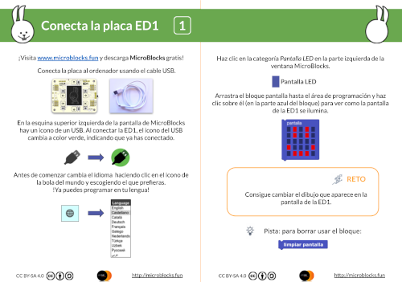

# ED1 Development Board User Manual

## Overview

The ED1 microcontroller board is designed by **Citilab** as an innovative educational tool aimed at promoting learning and development in fields such as robotics, creative electronics, home automation, and the Internet of Things (IoT). With its rich connectivity options and powerful features, the ED1 board provides an interactive and flexible learning environment for students, educators, and enthusiasts, while also being suitable for developers and makers to create prototypes and experiments. The device has been awarded **CE certification**, ensuring safety and reliability during use.
<iframe width="560" height="315" src="https://www.youtube.com/embed/ZGvE_8RV73w?si=1Rl-cxDMnxHdVVKg" title="YouTube video player" frameborder="0" allow="accelerometer; autoplay; clipboard-write; encrypted-media; gyroscope; picture-in-picture; web-share" referrerpolicy="strict-origin-when-cross-origin" allowfullscreen></iframe>

## Key Features

### 1. Processor
- **ESP32 Processor**: This board is equipped with a low-power dual-core 32-bit ESP32 processor, capable of running at frequencies up to 160 MHz, supporting complex data processing and multitasking management.
- **Memory**: It comes with 448 KB of ROM and 520 KB of RAM, allowing multiple applications and functionalities to run in parallel.

### 2. Connectivity
- **Wi-Fi**: Supports the 802.11 b/g/n standard, providing excellent wireless connectivity suitable for various IoT applications.
- **Bluetooth**: The support for Bluetooth v4.2 BR/EDR and BLE allows the ED1 board to seamlessly interact with other Bluetooth devices, expanding its application scenarios.

### 3. Input/Output Interfaces
- **Digital Input/Output (I/O)**:
  - Provides 4 digital I/O ports, with 2 supporting 3.3V (maximum current 0.5A) and 2 supporting 5.0V (maximum current 1A) to accommodate various external device connection needs.
- **Analog Input**:
  - Equipped with 4 analog inputs at 10-bit resolution, enabling accurate readings of analog signals from sensors suitable for various sensor applications.
- **Connectors**:
  - Features I2C expansion connectors and SPI connectors, allowing easy connection of additional external sensors and actuators, greatly expanding functionality.

### 4. Sensors
- **Touch Buttons**: Equipped with 6 touch buttons, allowing users to interact directly with the board and providing a flexible user experience.
- **Accelerometer**: The integrated LIS3DH 3-axis accelerometer can detect the device's motion and tilt, making it suitable for motion detection and game development.
- **Light Sensor**: The ambient light sensor A-PT19 is capable of sensing surrounding light intensity, suitable for smart lighting and environmental monitoring.
- **Infrared Receiver**: The TSOP754 infrared receiver supports remote control functionality, allowing users to interact with the device using a remote control.

### 5. Actuators
- **Display Screen**: Comes with a 128×128 pixel color LCD screen, supporting real-time information display and graphical output, ideal for various user interface designs.
- **Stepper Motor**: Provides 2 stepper motor connectors (compatible with the 28BYJ-48 model), suitable for mechanical applications requiring precise control.
- **Speaker**: Built-in mini speaker (buzzer) can provide audio feedback such as alarms, music, or notifications, enhancing user interaction.

### 6. Power and Connections
- **Power Interface**: Uses a USB-C connector, supporting faster charging and convenient data transfer, compatible with multiple power adapters.
- **Battery**: Supports 16340 or RCR123A rechargeable batteries, using an integrated charging manager to provide intuitive battery status monitoring via a charging indicator.
- **Safety Design**: Features a battery disconnect switch to ensure safety during prolonged disuse or charging, providing higher usage assurance for users.

### 7. Programming Environment
- **Programmability**: The ED1 board supports programming in the **Microblocks** environment, which is a graphical block-based programming language that lowers the barriers to entry, making it suitable for students and beginners.
- **Network Connectivity**: By utilizing the HTTP protocol, the board can connect to the **Mozilla Web of Things** for IoT application development.
- **Supported Software**: Development is underway for connections with **Snap** and **Scratch**, enabling further utilization of existing programming resources to enhance the programming experience.

## Debugging Guide

### Overview
Debugging is a key step to ensure that the ED1 board works smoothly with the MicroBlocks programming environment. By effectively executing the debugging process, you can check and optimize connections to ensure all components are functioning properly, thus improving overall project performance.

### 1. Downloading and Installing MicroBlocks
You can access the MicroBlocks programming environment through the following methods:

- **Online Version**: Directly visit the MicroBlocks official website to experience the web-based programming environment.
- **Local Installation Version**: It is recommended to download and install the local version for faster response times and automatic connectivity.

**[Download MicroBlocks](https://microblocks.fun/)**

<iframe width="560" height="315" src="https://www.youtube.com/embed/qyQZplS1ilA?si=-W1MIYbMX4P04vMI" title="YouTube video player" frameborder="0" allow="accelerometer; autoplay; clipboard-write; encrypted-media; gyroscope; picture-in-picture; web-share" referrerpolicy="strict-origin-when-cross-origin" allowfullscreen></iframe>

### 2. Installing Drivers

To ensure that your computer can detect the connected ED1 board, please install the appropriate drivers. This will allow you to interact with the hardware through the programming software and ensure smooth communication.
<iframe width="560" height="315" src="https://www.youtube.com/embed/y2p4CfLo-IE?si=LujopJan1mP24T49" title="YouTube video player" frameborder="0" allow="accelerometer; autoplay; clipboard-write; encrypted-media; gyroscope; picture-in-picture; web-share" referrerpolicy="strict-origin-when-cross-origin" allowfullscreen></iframe>

### 3. Resetting the Mainboard
If you encounter a freeze or need to update the firmware, you can reset the mainboard using the following steps:

1. **Disconnect Power**: Remove the power connection, ensuring the mainboard is powered off.
2. **Press the Reset Button**: Hold down the reset button on the mainboard while reconnecting the power.
3. **Firmware Update**: Use MicroBlocks software to perform a firmware update, ensuring that the mainboard runs the latest software version.
<iframe width="560" height="315" src="https://www.youtube.com/embed/0TfPV5D_0g8?si=4Zl4jXqYK0JhFXup" title="YouTube video player" frameborder="0" allow="accelerometer; autoplay; clipboard-write; encrypted-media; gyroscope; picture-in-picture; web-share" referrerpolicy="strict-origin-when-cross-origin" allowfullscreen></iframe>

### 4. Checking Sensors and Actuators
It is advisable to check each sensor and actuator on the board individually to verify their proper operation:

1. **Write Test Code**: In MicroBlocks, write simple test programs to read from and control each sensor and actuator to check their functionality.
2. **Verify Operation**: After running the program, observe the LED lights and the LCD display output to ensure all components work as expected.
<iframe width="560" height="315" src="https://www.youtube.com/embed/L4uwlqeAMKA?si=PYhSJ5gH9htmfg_t" title="YouTube video player" frameborder="0" allow="accelerometer; autoplay; clipboard-write; encrypted-media; gyroscope; picture-in-picture; web-share" referrerpolicy="strict-origin-when-cross-origin" allowfullscreen></iframe>

### 5. Charging the Battery
Use a USB-C connector to charge the battery, ensuring the charging indicator light works correctly to verify whether the battery is fully charged for normal device operation.
<iframe width="560" height="315" src="https://www.youtube.com/embed/dDExXvQ3EAA?si=O20IBx7F0ky5ZjjY" title="YouTube video player" frameborder="0" allow="accelerometer; autoplay; clipboard-write; encrypted-media; gyroscope; picture-in-picture; web-share" referrerpolicy="strict-origin-when-cross-origin" allowfullscreen></iframe>

### 6. Components Compatible with the Mainboard
The ED1 board features pins and interfaces that can connect to external components, ensuring that selected sensors and actuators are compatible with the ED1 board to maximize the device's functionality.
<iframe width="560" height="315" src="https://www.youtube.com/embed/wYD9NQ-OAnA?si=jsvKj6QAScQqCGyD" title="YouTube video player" frameborder="0" allow="accelerometer; autoplay; clipboard-write; encrypted-media; gyroscope; picture-in-picture; web-share" referrerpolicy="strict-origin-when-cross-origin" allowfullscreen></iframe>

### 7. Notes and Suggestions
- **Frequent Saving**: While working in MicroBlocks, please save your code regularly to prevent data loss.
- **Keep Software and Firmware Up to Date**: Regularly check for and update MicroBlocks and the ED1 board firmware to ensure you are using the latest features and fixes.
- **Refer to Community Resources**: If you encounter issues, feel free to visit the Citilab or MicroBlocks online community for technical support and user feedback.

### 8. Interactive Experience
Combining MicroBlocks and the ED1 board allows you to engage in deeper learning and experimentation, enhancing interactivity by utilizing the virtual world of Snap. This cross-disciplinary integration greatly enriches the learning experience while fostering creativity and enjoyment.
<iframe width="560" height="315" src="https://www.youtube.com/embed/ipJSom2kFkA?si=62lB8F9g9nt3E5Xo" title="YouTube video player" frameborder="0" allow="accelerometer; autoplay; clipboard-write; encrypted-media; gyroscope; picture-in-picture; web-share" referrerpolicy="strict-origin-when-cross-origin" allowfullscreen></iframe>

## Getting Started with Programming

### Overview

Download the MicroBlocks ED1 programming card to get started. Complete challenges step-by-step to discover the basic functionalities that can help you start your first project!

**[DOWNLOAD PDF CARD](MicroBlocks-ED1-Cards.pdf)**

### Example Videos
The following are some short video examples intended to help you better understand how to use MicroBlocks to write code:

1. **Changing the Screen Color**: Demonstrates how to control the color of the display through programming.
 
<iframe width="560" height="315" src="https://www.youtube.com/embed/T1NzLm44zFg?si=bJq1FKFZDtEwdt-b" title="YouTube video player" frameborder="0" allow="accelerometer; autoplay; clipboard-write; encrypted-media; gyroscope; picture-in-picture; web-share" referrerpolicy="strict-origin-when-cross-origin" allowfullscreen></iframe>

2. **Square Iteration**: Shows how to achieve iterative effects in graphics, bringing visual changes.

<iframe width="560" height="315" src="https://www.youtube.com/embed/c2UYpdsG2pQ?si=at24d-Oqm-I26Gnj" title="YouTube video player" frameborder="0" allow="accelerometer; autoplay; clipboard-write; encrypted-media; gyroscope; picture-in-picture; web-share" referrerpolicy="strict-origin-when-cross-origin" allowfullscreen></iframe>

Use example code to [open MicroBlocks](https://microblocks.fun/run/microblocks.html#scripts=GP%20Script%0Adepends%20%27ED1%20Buttons%27%20%27TFT%27%0A%0Ascript%20376%2078%20%7B%0AwhenCondition%20%28%27OK%20button%27%29%0Aforever%20%7B%0A%20%20for%20i%20%28%28%27%5Btft%3AgetWidth%5D%27%29%20%2F%202%29%20%7B%0A%20%20%20%20%27%5Btft%3Arect%5D%27%20i%20i%20%28%28%27%5Btft%3AgetWidth%5D%27%29%20-%20%28i%20%2A%202%29%29%20%28%28%27%5Btft%3AgetHeight%5D%27%29%20-%20%28i%20%2A%202%29%29%20%28randomColor%29%20false%0A%20%20%7D%0A%20%20waitMillis%2040%0A%7D%0A%7D%0A%0A)

3. **Displaying Text on the Screen**: Demonstrates how to send and display text information on the LCD screen.

<iframe width="560" height="315" src="https://www.youtube.com/embed/nrm5y1FHb0I?si=nd208uokJpImdXyx" title="YouTube video player" frameborder="0" allow="accelerometer; autoplay; clipboard-write; encrypted-media; gyroscope; picture-in-picture; web-share" referrerpolicy="strict-origin-when-cross-origin" allowfullscreen></iframe>

Use example code to [open MicroBlocks](https://microblocks.fun/run/microblocks.html#scripts=GP%20Script%0Adepends%20%27LED%20Display%27%20%27TFT%27%0A%0Ascript%20557%20118%20%7B%0AwhenStarted%0A%27%5Bdisplay%3AmbDisplayOff%5D%27%0Afor%20i%2010%20%7B%0A%20%20escala%20%3D%20i%0A%20%20%27%5Btft%3Atext%5D%27%20%27ED1%27%20%28%28%28%27%5Btft%3AgetWidth%5D%27%29%20-%20%28%28size%20%27ED1%27%29%20%2A%20%285%20%2A%20escala%29%29%29%20%2F%202%29%20%28%28%28%27%5Btft%3AgetHeight%5D%27%29%20-%20%281%20%2A%20%287%20%2A%20escala%29%29%29%20%2F%202%29%20%28randomColor%29%20escala%20false%0A%20%20waitMillis%20200%0A%7D%0A%7D%0A%0A)

4. **Line Drawing**: Demonstrates how to draw simple line graphics on the screen, helping to understand the basics of graphic drawing.

<iframe width="560" height="315" src="https://www.youtube.com/embed/DiN8qfSdxSE?si=GLylqZWwSR31DBtE" title="YouTube video player" frameborder="0" allow="accelerometer; autoplay; clipboard-write; encrypted-media; gyroscope; picture-in-picture; web-share" referrerpolicy="strict-origin-when-cross-origin" allowfullscreen></iframe>

Use example code to [open MicroBlocks](https://microblocks.fun/run/microblocks.html#scripts=GP%20Script%0Adepends%20%27ED1%20Buttons%27%20%27LED%20Display%27%20%27TFT%27%20%27Turtle%27%0A%0Ascript%20497%20105%20%7B%0AwhenStarted%0Ahome%0A%27set%20pen%20color%20to%27%20%28colorSwatch%2035%20190%2030%20255%29%0A%27pen%20down%27%0Aforever%20%7B%0A%20%20if%20%28%27up%20button%27%29%20%7B%0A%20%20%20%20setHeading%20270%0A%20%20%20%20move%202%0A%20%20%7D%20%28%27down%20button%27%29%20%7B%0A%20%20%20%20setHeading%2090%0A%20%20%20%20move%202%0A%20%20%7D%20%28%27left%20button%27%29%20%7B%0A%20%20%20%20setHeading%20180%0A%20%20%20%20move%202%0A%20%20%7D%20%28%27right%20button%27%29%20%7B%0A%20%20%20%20setHeading%200%0A%20%20%20%20move%202%0A%20%20%7D%20%28%27cancel%20button%27%29%20%7B%0A%20%20%20%20%27%5Bdisplay%3AmbDisplayOff%5D%27%0A%20%20%7D%0A%20%20waitMillis%2050%0A%7D%0A%7D%0A%0A)

5. **Drawing a Mandala**: Demonstrates how to create complex mandala patterns through code to inspire creativity.

<iframe width="560" height="315" src="https://www.youtube.com/embed/SOyh-9IpydI?si=VsiNKH4RzhegBdAf" title="YouTube video player" frameborder="0" allow="accelerometer; autoplay; clipboard-write; encrypted-media; gyroscope; picture-in-picture; web-share" referrerpolicy="strict-origin-when-cross-origin" allowfullscreen></iframe>

Use example code to [open MicroBlocks](https://microblocks.fun/run/microblocks.html#scripts=GP%20Script%0Adepends%20%27LED%20Display%27%20%27TFT%27%20%27Turtle%27%0A%0Ascript%20458%2090%20%7B%0AwhenStarted%0Ahome%0A%27pen%20down%27%0A%27%5Bdisplay%3AmbDisplayOff%5D%27%0Arepeat%2015%20%7B%0A%20%20%27set%20pen%20color%20to%27%20%28randomColor%29%0A%20%20repeat%204%20%7B%0A%20%20%20%20move%2040%0A%20%20%20%20turnBy%2090%0A%20%20%7D%0A%20%20turnFraction%201%2015%0A%7D%0A%7D%0A%0A)

## Safety Instructions
The ED1 kit is designed for educational purposes and should be used under the supervision of an adult instructor. Please follow these safety guidelines during use:

1. **Appropriate Age**: This kit is not suitable for children under 8 years old.
2. **Prevent Metal Contact**: Avoid placing metal objects on either side of the ED1 board to prevent short circuits.
3. **Moisture Use**: Do not use the board in wet conditions or with wet hands to avoid short circuits or damage.
4. **Supervised Use**: Do not leave the ED1 board connected to devices unattended.
5. **Electrical Limitations**:
   - When connecting external devices, abide by electrical polarity and specifications.
   - The maximum output current is 100mA, and maximum input voltage is 5V.
6. **Power Management**: Always ensure the power switch is turned off when not in use to prolong battery life and ensure safety.